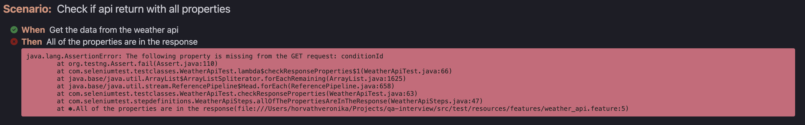
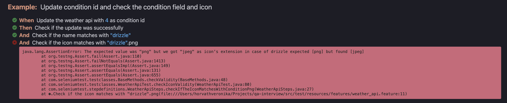
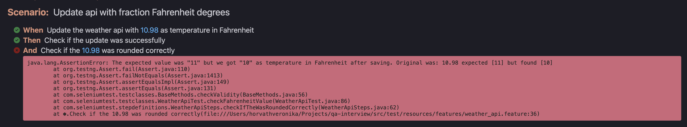
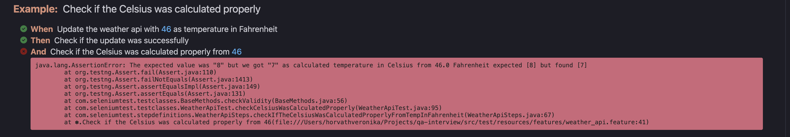
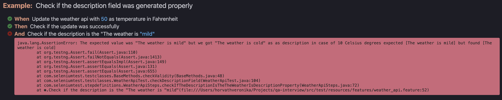
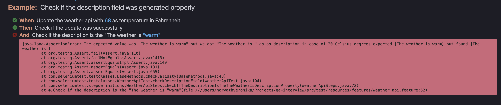

# Reports
Full report is in  /reports/html-reports.html
Check the logs about the technical results in /results/appLog.log

## Weather api

### Check if api return all properties

*The following property is missing from the GET request: conditionId*
##
### Update condition id and check the condition field and icon

*The expected value was "png" but we got "jpeg" as icon's extension in case of drizzle*
##
### Update api with negative Fahrenheit degrees
*PASSED*
##
### Update api with fraction Fahrenheit degrees

*The expected value was "11" but we got "10" as temperature in Fahrenheit after saving. Original was: 10.98*
##
### Check if the Celsius was calculated properly

*The expected value was "8" but we got "7" as calculated temperature in Celsius from 46.0 Fahrenheit*
##
### Check if the description field was generated properly

*The expected value was "The weather is mild" but we got "The weather is cold" as description in case of 10 Celsius degrees*

*The expected value was "The weather is warm" but we got "The weather is " as as description in case of 20 Celsius degrees*

## Weather api
### Check the placeholder's text
*PASSED*
##
### Check search flow and expected Date and Time
*PASSED*